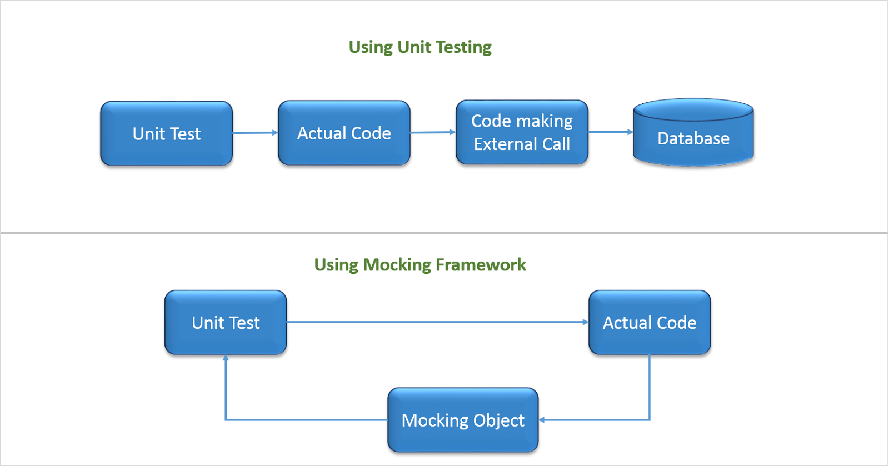

## C# NUnit Moq
### Project for working study

environment

1. [C# ( .NetFramework )](https://docs.microsoft.com/ko-kr/dotnet/csharp/)
2. [NUnit](https://nunit.org/)
3. [Moq](https://github.com/moq/moq4)

### Goal of this project

##### Understanding Unit testing and Mocking(such as DB, Hardware resource).

image : [[Website].(2020. 09. 06)https://systemsplusgroup.blogspot.com/2017/10/unit-testing-using-xunit.html](https://systemsplusgroup.blogspot.com/2017/10/unit-testing-using-xunit.html)

##### Understanding MVVM(Model-View-ViewModel) Pattern

image : [[Website].(2020. 09. 06)https://ko.wikipedia.org/wiki/%EB%AA%A8%EB%8D%B8-%EB%B7%B0-%EB%B7%B0%EB%AA%A8%EB%8D%B8](https://ko.wikipedia.org/wiki/%EB%AA%A8%EB%8D%B8-%EB%B7%B0-%EB%B7%B0%EB%AA%A8%EB%8D%B8)

